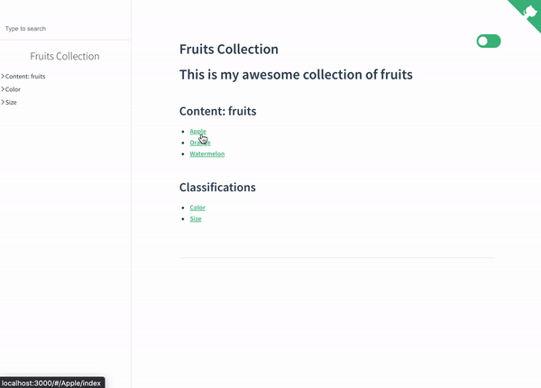

<!--
This README.md file was generated from an open source template.
Have a look at it! https://gist.github.com/reymon359/a0880e5b3bfcbac54f58b52b3ade2e02
-->

<!-- Logo (with link) -->
<p align="center">
 <a href="https://reymon359.github.io/collman">
   
 </a>
</p>

<!-- Title -->
<h1 align="center">
 Collman
</h1>

<!-- Badges (with link) -->

<p align="center">
 <a href="https://github.com/reymon359/collman/actions/workflows/main.yml">
   
 </a>
 <a href="https://github.com/reymon359/collman/commits/master">
   
 </a>
 <a href="https://github.com/reymon359/collman/blob/master/LICENSE">
   
 </a>
 <a href="https://github.com/reymon359/collman/releases">
   
 </a>
</p>

<p align="center">
Easily manage and display agnostic collections.
</p>

We, as humans tend to classify things, to group them, is in our nature. This project aims to create a tool to help managing any collection and classify its content in an agnostic way.

Create anything with just Markdown to edit the content effortlessly.

## Table of Contents

- [Table of Contents](#table-of-contents)
- [How to use it](#how-to-use-it)
  - [Install Collman](#install-collman)
  - [Create a collection](#create-a-collection)
  - [Run `collman`](#run-collman)
- [Visualize it](#visualize-it)
  - [Why Docsify](#why-docsify)
- [Configuration](#configuration)
  - [Configuration file](#configuration-file)
  - [Command line arguments](#command-line-arguments)
  - [Docsify config file](#docsify-config-file)

## How to use it

Basic commands and usage example

### Install Collman

Running `npm i -g collman` will do

### Create a collection

Let's create a _fruits' collection_ as an example. You can find it in the `assets/examples` directory from this repository.

First, create a directory with any name you want.

```text
📁 my-collection
```

Now create a directory for your **items** and add an `index.md` file to it. In this example the `fruits`.

```text
📁 my-collection
└── 📁 fruits
    └── 📄 index.md
```

Inside the `ìndex.md` file add a name for your collection in the _front matter_ and a description about your collection outside it.

```md
---
name: 'Fruits Collection'
---
# This is my awesome collection of fruits
```

Now lets add an **item** to the **items** directory. An **item** is nothing but a directory that contains at least an `index.md` file with the _content_ of your **item.**

```text
📁 my-collection
└── 📁 fruits
    └── 📁 apple
    │   └── 📄 index.md
    └── 📄 index.md
```

Add the name inside the `index.md` _front matter_ and the content below it.

```md
---
name: 'Apple'
---
Apples are **amazing.**
```

Additionally, an **item** can contain an `assets` directory to store images referenced in the `index.md`. Have a look at the watermelon item in our example.

```text
📁 my-collection
└── 📁 fruits
    └── 📁 apple
    │   └── 📄 index.md
    └── 📁 orange
    │   └── 📄 index.md
    └── 📁 watermelon
    │   └── 📁 assets
    │   │   └── 📄 watermelon.png
    │   └── 📄 index.md
    ├── ...
    ...
    └── 📄 index.md
```

This would be its `index.md`.

```md
---
name: 'Watermelon'
---
I like this watermelon picture
 

```

And finally you can add **Classifications** to your items. A **Classification** is an agnostic way to group items according to the values you give to it. You just have to add an array of values in the front matter of the item. Here I am adding two classifications to my orange item `index.md`: `Color` and `Size` and adding them some values.

```md
---
name: 'Orange'
Color: ['Orange']
Size: ['Medium']
---
It is my favourite fruit
```

### Run `collman`

Once we have the collection ready, in a terminal in the collection directory, we run `collman --id name-input-directory`. Going on with the previous example it would be `collman --id fruits`. The input directory name is not needed if you name your directory `ìtems` which is the default one. As we named it `fruits` we have to pass the command line argument.

You will see this output:

```shell
user@user-pc my-collection % collman --id fruits
👀 Getting collection based on the configuration
✅ Collection got: Fruits Collection
🚧 Processing collection and saving in directory: docs
🎉 Collection processed and saved successfully
🎨 Docsify enabled. Adding it to the collection
🖼 Docsify added successfully to the collection. To have a look just do two things:
1. Install Docsify: npm i docsify-cli -g
2. Run: docsify serve docs
```

This will create a `docs` directory with the collection ready. Go to https://github.com/reymon359/collman/tree/master/assets/examples/my-collection/docs to see the one auto generated for the example.

## Visualize it

By default, the collection generated is made to be easily visualized on a markdown viewer or GitHub. Have a look at the example collection [my-collection docs](https://github.com/reymon359/collman/tree/master/assets/examples/my-collection/docs).

To visualize a Collection in a better way, Collman generates the files needed to integrate with [Docsify.](https://github.com/docsifyjs/docsify/). Therefore, you just have to:

1. Install Docsify: `npm i docsify-cli -g`
2. And run: `docsify serve docs`

Here is how the example collection will be visualized with Docsify



### Why Docsify

At first Collman was supposed to include something similar to display a collection. Then decided to _not reinvent the wheel_ and research documentation libraries to fulfil this purpose.

I found Docsify to be the simplest one of them to work with _markdown_ files. The minimum requirement is just to add an `index.html` to the directory you want to serve.

It also has plenty of official and community-made plugins to improve the way you display the content which added key features for Collman.

## Configuration

Some behavior of Collman can be configured to get a different output.

| Value             | Type    | Description                                              | Default value             | Command line argument |
|-------------------|---------|----------------------------------------------------------|---------------------------|-----------------------|
| pathRootDirectory | string  | The path of the directory containing the items' directory | `'./'` (The current path) | `--prd`               |
| inputDirectory    | string  | The directory name with the collection items             | `'items'`                 | `--id`                |
| outputDirectory   | string  | The directory name for the output collection             | `'docs'`                  | `--od`                |
| docsify           | boolean | Enable Docsify visualization with the collection         | `true`                    | `--ds`                |

There are to ways of working with the Collman configuration.

### Configuration file

You can add a configuration file named `collman.config.js` in the root directory with the config you want. If you don't add a value it will use the default one.

Example

```js
module.exports = {
  pathRootDirectory: './',
  inputDirectory: 'fruits',
  outputDirectory: 'docs',
  docsify: true
}
```

### Command line arguments

You can also pass all the configuration values as command line arguments. We did it with the input directory in the fruits' collection example `collman --id fruits`.

Check the configuration table above to see how to use them.

### Docsify config file

You can configure the Docsify visualiitacion in a way similar to `collman.config.js`. 

First create a `docsify.config.js` file like the one below:

```js
module.exports = {
  main: {
  },
  scriptsAndLinks:[]
}
```

It has two parts: The `main` and the `scriptsAndLinks`.

The first one makes reference to the attributes that you pass to the window docsify object `window.$docsify = {}`. The second one is an array with the scripts and links we want to load.

Here is an example with the default Collman values:

```js
module.exports = {
  main: {
    name: 'Default Collection',
    themeColor: '#20304a',
    loadSidebar: true,
    mergeNavbar: true,
    alias: {
      '/.*/_sidebar.md': '/_sidebar.md'
    },
    subMaxLevel: 3,
    search: 'auto'
  },
  scriptsAndLinks:[
    '<link rel="stylesheet" href="https://cdn.jsdelivr.net/npm/docsify-themeable@0/dist/css/theme-simple.css">',
    '<script src="//cdn.jsdelivr.net/npm/docsify@4"></script>',
    '<script src="//cdn.jsdelivr.net/npm/docsify/lib/plugins/search.min.js"></script>',
    '<script src="//cdn.jsdelivr.net/npm/docsify-sidebar-collapse/dist/docsify-sidebar-collapse.min.js"></script>',
    '<link rel="stylesheet" href="//cdn.jsdelivr.net/npm/docsify-sidebar-collapse/dist/sidebar.min.css" />',
    '<script src="https://cdn.jsdelivr.net/npm/docsify-themeable@0/dist/js/docsify-themeable.min.js"></script>',
    '<script src="//cdn.jsdelivr.net/npm/docsify-pagination/dist/docsify-pagination.min.js"></script>',
    '<script src="//cdn.jsdelivr.net/npm/docsify/lib/plugins/zoom-image.min.js"></script>'
  ]
}
```
